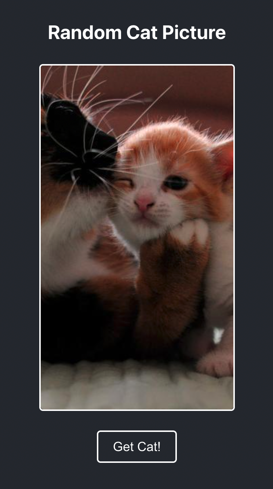

# Random Cat Pic App 
### [JT Black](https://jtblack.co.uk/)

This app was built as a Technical Test for ClearBank.

### Deployed App
Try the app, because everyone loves cats!  
### [Random Cat Picture](https://)

### Tech Stack:
- HTML
- CSS
- Javascript
- React

### App Functionality
The app uses the [Cat API](https://thecatapi.com/) to return a random cat picture on loading and subsequent button click by the user.

### App Walkthrough
The app uses a couple React components to render the HTML and the images. The images are returned from the API using JavaScript's native fetch function.
### Desktop

  

### Mobile

  

